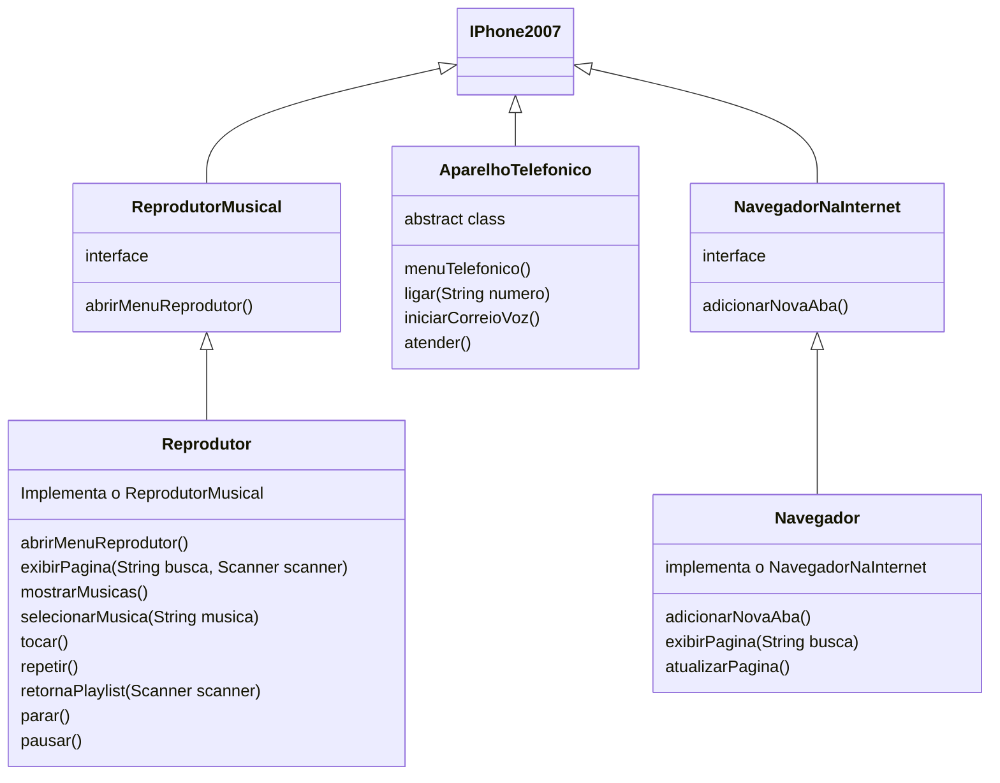

# Modelagem e Diagramação de um Componente iPhone
Este é um desafio de Programação Orientada a Objetos (POO) da **DIO**, no qual pude desenvolver, no VS Code, funcionalidades  implantando  as classes e interfaces no formato de arquivos .java.
O objetivo do desafio é modelar e diagramar a representação UML do componente iPhone, abrangendo suas funcionalidades como Reprodutor Musical, Aparelho Telefônico e Navegador na Internet.

## Funcionalidades modeladas
### 1 - Reprodutor Musical 
Nesta funcionalidade o usuário poderá selelecionar entre:
- **Ouvir música pela PlayList** 
Ao selecionar a PlayList aparecerá uma lista de músicas, na qual escolherá uma das músicas da Lista para tocar ou  adicionar uma nova.
Caso seja adicionar, é só digitar o nome do cantor e da música que ela será includa na PlayList.
Caso escolha uma das música existentes na lista, o usuário poderá colocar para tocar, pausar, repetir, parar e escolher outra música.
- **Ver vídeos no YouTube**
Aqui, o usuário irá fazer pesquisas, basta digitar o que deseja e sua pesquisa irá aparecer direto na página do **YouTube**. E se não for o que procurava poderá ser feito uma nova pesquisa.
 
Métodos:
>interface ReprodutorMusical
abrirMenuReprodutor()
class Reprodutor implements ReprodutorMusical
abrirMenuReprodutor(), exibirPagina(String busca, Scanner scanner), mostrarMusicas(), selecionarMusica(String musica), tocar(), repetir(), retornaPlaylist(Scanner scanner), parar(), pausar().

### 2 - Aparelho Telefônico
Nesta funcionalidade o usuário poderá:
- **Ligar**
Nesta função, deve-se digitar o número que deseja, a ligação será iniciada.
Caso ninguém atenda, após 3 tentativas, aparecerá a opção correio de voz.
E se atender terá a opção de deligar a ligação.
- **Atender**
Já neste o usuário poderá optar em atender ou não a uma ligação recebida. Caso atenda, terá a opção de desligar.

Métodos: 
>abstract class AparelhoTelefonico
menuTelefonico(), ligar(String numero), atender(),iniciarCorreioVoz().

### 3 - Navegador na Internet
Nesta funcionalidae o usuário poderá fazer pesquisas. E caso ele não tenha encontrado o que deseja, poderá fazer uma nova pesquisa detalhando melhor o que procura.
Todas as pequisas serão abertas na página do **Google**.

Métodos: 
>interface NavegadorNaInternet 
adicionarNovaAba() 
class Navegador implements NavegadorNaInternet
exibirPagina(String busca), adicionarNovaAba(), atualizarPagina().

## Diagrama UML
Conforme sugerido, para elaborar o diagrama foi utilizada a extenção Markdown Preview Mermaid Support.

